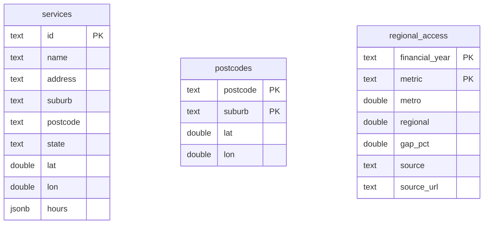
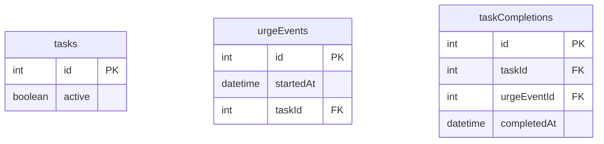

# Data Management Plan — Curbi

FIT5120 Industry Experience, Team Health-Tech. Iteration 1.

This plan covers how Curbi acquires, cleans, stores, serves, maintains and
governs its data. It reflects the implemented system as of the current
`iteration-1` branch.

---

## 1. Purpose and scope

Curbi uses three open datasets to power two features and one onboarding screen:

| Feature | Data used |
|---|---|
| Help Finder (Epic 2 / US2) | Victorian mental health services; a suburb/postcode → coordinate lookup |
| Regional access snapshot (Epic 4 / US4) | AIHW metro-vs-regional Medicare mental health service rates |

Separately, the app keeps a **personal, on-device record** of the user's coping
tasks, checking-urge events and task completions (Epic 1). That record is out of
scope for server-side data management because it never leaves the user's browser
(see §7).

Two constraints from the teaching team shape the whole design:

1. **No processed data may be hard-coded into the app.** Data must be served from
   a hosted relational database, read in real time. Cleaning datasets offline is
   permitted; a cleaned JSON file committed to the repository and shipped in the
   build is not.
2. **The live database must be writable at any time** — adding a new release of a
   source must not require rebuilding the database from scratch.

---

## 2. Data sources

| # | Dataset | Provider | Access method | Format | Licence | Update cadence |
|---|---|---|---|---|---|---|
| 1 | NHSD – Services Directory 2025 | Healthdirect Australia, obtained via AURIN (`data.aurin.org.au`) | Manual download; requires an Australian-university login and two click-through agreements (an "Academic Confirmation" and the NHSD data agreement) | CSV (~55 MB, ~129,231 rows, all of Australia) | **Not a plain open licence.** Academic-use agreement; whether a filtered subset may ship in a publicly-deployed app is an open question — see §7 | Point-in-time extract "as at June 2025"; refreshed only when a new extract is published |
| 2 | Australian Postcodes | Matthew Proctor (`matthewproctor.com/australian_postcodes`) | Direct file download | JSON (~22 MB, 18,559 rows) | **CC BY 4.0** — attribution required | Community-maintained; changes rarely |
| 3 | Medicare mental health services — annual PHN data tables | Australian Institute of Health and Welfare (`aihw.gov.au/mental-health/resources/data-tables`) | Manual download of the per-release ZIP | CSV inside a ZIP, Windows-1252 encoded (2024–25 release, published May 2026) | AIHW open (CC BY — exact statement to be copied from the source page) | Annual (~May) |

Raw source files live in `data-pipeline/input/` on a developer machine. They are
git-ignored and re-downloadable from the sources above.

---

## 3. Data pipeline and wrangling

Every dataset follows the same three stages. Nothing is fetched or parsed at
request time.

```
raw source file (data-pipeline/input/, git-ignored)
   │  npm run build:<name>        Node ETL — filter / aggregate / trim
   ▼
data-pipeline/output/<name>.json  build artifact only, git-ignored, not served
   │  python backend/build_<name>_db.py   upsert into the database
   ▼
AWS RDS PostgreSQL table          the single served copy
```

### 3.1 NHSD services → `services`

**Clean (`data-pipeline/src/build-nhsd.js`)**

- Keep a row when: `state == "VIC"`, **and** the service name matches
  `/psycholog|psychiatr|psychotherap|counsell|counselin|mental health|headspace/i`,
  **and** latitude/longitude are finite and inside a loose Victoria bounding box.
- **Not** filtered on the `status` column: 88% of rows read `CLOSED`, which
  reflects "outside opening hours at the snapshot time", not "business closed".
- De-duplicated on `name|address|suburb` — NHSD assigns a distinct
  `nhsd_service_id` to repeated rows for the same organisation at the same
  address, so the id does not de-duplicate them.
- Each record is trimmed to `{ id, name, address, suburb, postcode, state, lat,
  lon, hours? }`, where `hours` keeps only the populated weekdays.

**Result:** 1,308 Victorian mental health services (~450 KB JSON).

**Load (`backend/build_nhsd_db.py`)** — `INSERT … ON CONFLICT (id) DO UPDATE`
into `services`. `hours` is stored as `JSONB`.

**Data caveats**

- *No service-type column.* Mental-health services are identified only by keyword
  match on the name. This misses services that do not state the profession (a GP
  clinic that also offers mental-health care, some social workers) and rarely
  admits a false positive (2 of 1,308 in the current output — "Nutritional
  Psychology", "Rural Financial Counselling Service" — ≈ 0.15%).
- *No phone / email / website column* in this extract — the UI shows name,
  address, suburb and opening hours only.
- ~143 kept records have "Confidential Address" or no street address (sole
  practitioners); they still carry a suburb and coordinates.

### 3.2 Australian Postcodes → `postcodes`

**Clean (`data-pipeline/src/build-postcodes.js`)** — keep rows where
`state == "VIC"` and `type == "Delivery Area"` (excludes PO boxes) with finite,
non-zero coordinates; upper-case the suburb; de-duplicate on `postcode|suburb`
(the source repeats a locality across statistical-area variants). Output record:
`{ postcode, suburb, lat, lon }`.

**Result:** 3,483 Victorian delivery-area entries.

**Load (`backend/build_postcodes_db.py`)** — upsert on `(postcode, suburb)`.

**Purpose.** The Help Finder does not use device location. The user types a
suburb or postcode; `GET /api/v1/geocode` turns it into a coordinate from this
table, which the service search then measures distance from.

### 3.3 AIHW PHN table → `regional_access`

**Clean (`data-pipeline/src/build-aihw.js`)**

- Read the `Medicare mental health services PHN SA4 <FY>.csv` entry from inside
  the ZIP (decoded from Windows-1252; values contain non-breaking spaces).
- Filter to `GeographicAreaType == PHN`, `ProviderType == "All providers"`, the
  latest `FinancialYear`.
- Take the arithmetic mean of the 3 Greater-Melbourne PHNs (North Western
  Melbourne, Eastern Melbourne, South Eastern Melbourne) and of the 3
  regional-Victoria PHNs (Gippsland, Murray, Western Victoria), for two measures:
  *service rate per 1,000 population* and *patient rate per 1,000 population*.
- `gapPct = round((regional / metro − 1) × 100, 1)`.
- If a configured PHN name is absent from a release, the script **errors** rather
  than silently averaging the wrong set.

**Result (2024–25):** service rate per 1,000 — metro 569, regional 458, gap
−19.6%; patient rate per 1,000 — metro 111, regional 107, gap −3.9%.

**Load (`backend/build_aihw_db.py`)** — flatten the two measures into rows and
upsert into `regional_access` on `(financial_year, metric)` (two rows per
release).

---

## 4. Storage and database design

### 4.1 Hosted database

**AWS RDS for PostgreSQL 18** — instance `curbi-db`, class `db.t4g.micro`, 20 GB,
region `ap-southeast-2` (Sydney). The backend connects with a `psycopg`
connection pool using `DATABASE_URL`, supplied as an environment variable and
never committed. Tables are created on backend startup with
`CREATE TABLE IF NOT EXISTS` (no migration framework — three static tables).

Why hosted, and not a file / on-device database: the teaching-team constraint in
§1. A file-based SQLite database committed to the repo, or IndexedDB in the
browser, would both count as shipping pre-processed data.

### 4.2 Entity-relationship diagram — hosted database



The three tables are independent — there are no foreign keys. `services` and
`postcodes` are related only at query time: a geocode result's coordinate is
passed to the service search as a `near=` parameter.

### 4.3 On-device store (not on the server)

The web app keeps a Dexie (IndexedDB) database in the browser for the user's
personal Epic 1 data:



This data is created and read entirely on the user's device. It is never
transmitted to the backend and the backend has no schema for it.

---

## 5. Data updates and maintenance

The loader scripts upsert, so a new release updates the live database in place —
no rebuild, no downtime, satisfying the "writable at any time" constraint.

| Dataset | Trigger | Steps | Owner |
|---|---|---|---|
| NHSD services | A new NHSD directory extract is published | Download to `data-pipeline/input/`; `npm run build:nhsd`; `python backend/build_nhsd_db.py` | Data owner |
| Australian Postcodes | Rarely — only if postcodes change materially | Download to `input/`; `npm run build:postcodes`; `python backend/build_postcodes_db.py` | Data owner |
| AIHW PHN table | Annual, ~May | Download the new ZIP to `input/`; `npm run build:aihw`; `python backend/build_aihw_db.py` | Data owner |

Ad-hoc corrections can be applied with a direct `INSERT … ON CONFLICT` against
the live database using the same shape as the loaders.

There is **no runtime auto-refresh**. An earlier design polled the AIHW catalogue
API on a schedule and fetched the Australian Postcodes file on startup; both were
removed because they targeted the wrong data shape and re-introduced a network
dependency at request time.

---

## 6. Analysis techniques and derived values

| Value shown to the user | Where it is computed | Method | Critical discussion |
|---|---|---|---|
| Distance from the typed location to each service; nearest 20 | `backend/main.py` (`get_services`), per request | Haversine great-circle distance to the nearest resolved suburb centroid; ascending sort; limit 20 | Straight-line, not travel distance. Suburb-centroid coordinates, not the exact address, so distances are approximate at street level. Computed per request because it depends on user input. |
| "is a mental health service" (which NHSD rows to keep) | `build-nhsd.js`, offline | Binary keyword classifier on the service name | No ground-truth labels, so recall is unknown and structurally limited — services that do not name a profession are missed. Precision on the current Victorian output is ≈ 99.85% (2 false positives in 1,308). Documented as a known limitation rather than corrected by hand. |
| Metro vs regional service / patient rate | `build-aihw.js`, offline | Arithmetic mean of 3 PHNs per region | **Unweighted** — a small PHN counts as much as a large one; a population-weighted mean would be more representative but AIHW does not publish PHN denominators in this table. "Service rate" also mixes access and underlying need. |
| Gap percentage | `build-aihw.js`, offline | `(regional / metro − 1) × 100`, one decimal place | A single-year point estimate; no confidence interval; not a trend. |
| Regional bar width on the onboarding screen | `RegionalAccessView.vue`, in the browser | `regional / metro` as a percentage | Presentation only; not a reported figure. |

---

## 7. Ethical, legal and privacy considerations

### Licensing and attribution

- **Australian Postcodes** — CC BY 4.0. Attribution to Matthew Proctor is carried
  in `build-postcodes.js` and must appear in the app's about/credits.
- **AIHW** — open (CC BY). Attribution and the financial year are shown on the
  onboarding screen and returned by the API.
- **NHSD via AURIN** — the highest-risk item. Access is gated behind an academic
  agreement, and the data names individual practitioners at specific addresses.
  Whether a filtered subset may be redistributed through a publicly-reachable URL
  (vs. academic use only, and vs. the "within Australia" / no-overseas-disclosure
  terms) must be confirmed against the NHSD agreement PDF **before public
  deployment**. Until then the Help Finder should be treated as not cleared for a
  public launch.

### Personal information

- The hosted database contains **no personal user data** — only published open
  datasets. Nothing a user enters about themselves is sent to the server.
- The user's health-anxiety behaviour log (checking-urge events, task
  completions) stays in on-device storage and is never transmitted.
- The Help Finder asks for **no device location** — only a typed suburb or
  postcode, which is used transiently and not stored.
- The one category of personal information in the system is third-party: the names
  and addresses of practitioners in the NHSD directory (a public directory, but
  see the licensing note above).

### Data integrity — no fabricated values

An earlier cached file (`aihw_snapshot.json`) carried invented
`estimated_wait_days` figures with no source. It has been removed. Every number
the app displays is traceable to one of the datasets in §2.

### No app-side medical judgment

The app does not triage, route or escalate based on inferred symptoms or anxiety
severity. It offers passive links and objective behavioural prompts only. The
regional access snapshot is context, shown identically to every user, and is not
personalised.

### AI-assisted development

Parts of the data pipeline, the backend and this document were drafted with the
assistance of Claude (Anthropic) via the Claude Code tool. All generated code was
reviewed by the team and verified end-to-end against the live database; all data
figures were checked against the source files.

---

## 8. Security and access control

- `DATABASE_URL` (host, database, credentials) is an environment variable.
  `backend/.env` is git-ignored; `backend/.env.example` carries only a template.
- RDS network access is controlled by a security group. In deployment the backend
  connects by **security-group reference**, and RDS public access is turned off.
  During development a single developer IP is allow-listed on port 5432.
- The API is **read-only** (GET only) and holds no personal data, so unauthorised
  read access would expose only already-public data. The integrity risk (a
  writer altering the tables) is mitigated by the loaders' ability to rebuild any
  table from source at any time, plus RDS automated backups.

---

## 9. Retention and archival

| Artifact | Where | Retention |
|---|---|---|
| Raw source files | `data-pipeline/input/` on a developer machine (git-ignored) | Kept for the life of the project; re-downloadable from the source |
| Cleaned JSON | `data-pipeline/output/` (git-ignored) | Disposable build artifact; regenerated on demand |
| Live database | AWS RDS `curbi-db` | The authoritative copy; RDS automated backups (1-day retention) give point-in-time recovery |
| Personal on-device data | The user's browser (IndexedDB) | Controlled by the user; removed when they clear site data |

No server-side user data means no user-data retention or deletion process is
required.

---

## 10. Known limitations and future work

- Confirm the NHSD redistribution question against the AURIN agreement before any
  public launch.
- Population-weight the PHN averages if AIHW publishes the denominators.
- Consider PostGIS and a spatial index if the `services` table grows well beyond a
  few thousand rows (the `near=` query currently loads the table and sorts in
  Python).
- A small admin endpoint or a scheduled job could automate the annual AIHW
  refresh once the source-file location is stable year to year.
- Copy the exact licence statements from each source page into §2.
